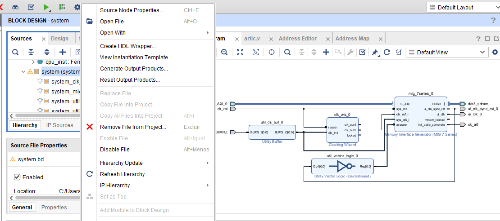

## 🚀 Como Preparar o Projeto no Vivado (Pós-Clone)

Como este repositório ignora arquivos temporários e binários pesados para economizar espaço, ao clonar o projeto na sua máquina, você precisará gerar os arquivos de suporte do Block Design (onde está configurado o controlador DDR3 e os clocks) antes de rodar a síntese.

Siga estes passos:

1. **Abra o Projeto:** Dê um duplo clique no arquivo `GIT.xpr` para abrir o projeto no Xilinx Vivado.
2. **Localize o Block Design:** No painel lateral esquerdo, vá na aba **Sources**, expanda a pasta **Design Sources** e procure pelo arquivo do Block Design chamado `system` (ou `system.bd`).
3. **Generate Output Products:** Clique com o botão direito em cima do `system.bd` e selecione **"Generate Output Products..."**. Na janela que abrir, deixe as opções padrão e clique em **Generate**. Aguarde o processo terminar (pode levar alguns minutos).
4. **Create HDL Wrapper:** Após a geração terminar, clique novamente com o botão direito no `system.bd` e selecione **"Create HDL Wrapper..."**. Escolha a opção *"Let Vivado manage wrapper and auto-update"* e dê OK.

Isso criará o arquivo `.v` de interface que conecta o seu diagrama de blocos ao resto do código em Verilog do processador RISC-V. Após isso, o projeto estará pronto para a Síntese (*Run Synthesis*) e Geração do Bitstream (*Generate Bitstream*)!

