# Configuração do Memory Interface Generator (MIG) para DDR3

Este guia detalha os parâmetros utilizados para configurar o controlador de memória DDR3 na FPGA (Artix-7 `xc7a35ti-csg324-1L`), utilizando a IP do **MIG 7 Series** no Vivado. 

As configurações a seguir foram adaptadas com base no excelente tutorial [MicroBlaze-DDR3-tutorial de viktor-nikolov](https://github.com/viktor-nikolov/MicroBlaze-DDR3-tutorial), ajustando os parâmetros físicos para o nosso hardware.

---

### Passo 1: Opções Iniciais e Interface AXI4
Criamos um novo design e habilitamos a interface **AXI4**. Isso é crucial, pois é através do barramento AXI que o nosso processador (no nosso caso o RISC-V) vai se comunicar com o controlador de memória de forma padronizada.

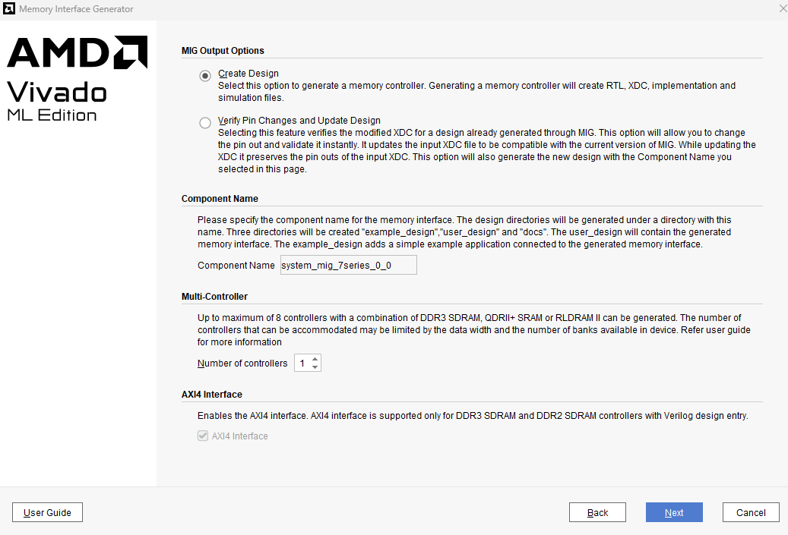

### Passo 2: Seleção da FPGA Compatível
Aqui apenas confirmamos o nosso *Target FPGA* (`xc7a35ti-csg324-1L`). Não é necessário selecionar dispositivos compatíveis adicionais a menos que você planeje portar o exato mesmo design de pinagem para outro chip Artix-7 da mesma família.

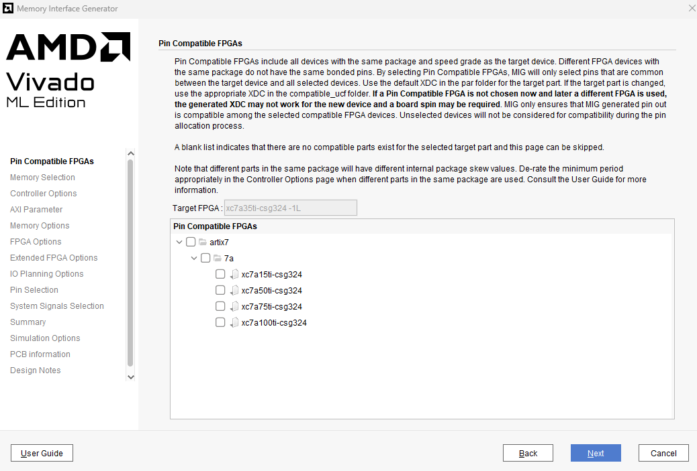

### Passo 3: Seleção do Tipo de Memória
Selecionamos a tecnologia física da nossa RAM externa: **DDR3 SDRAM**.

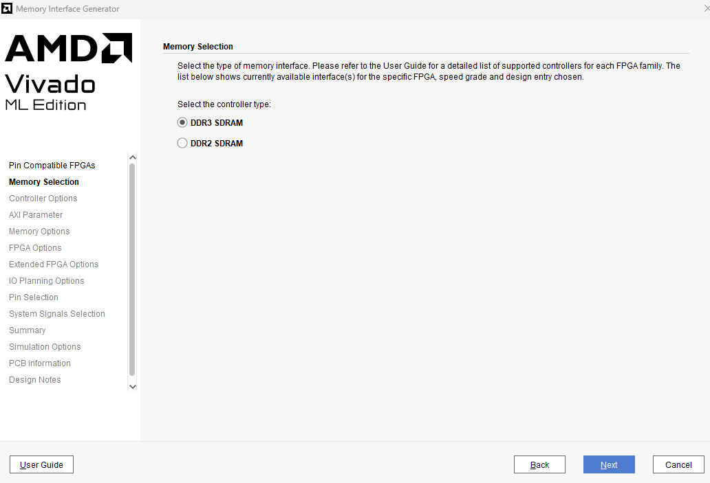

### Passo 4: Opções do Controlador (Clock e Part Number)
Esta é uma das telas mais importantes. Ela define a velocidade da memória e as suas características físicas.
* **Clock Period:** Configurado para `3077 ps` (~325 MHz). Esta é a frequência real que vai para o chip DDR3.
* **PHY to Controller Clock Ratio:** `4:1`. O controlador interno da FPGA vai rodar a 1/4 da velocidade da memória.
* **Memory Part:** `MT41K128M16XX-15E`. Este é o modelo exato do chip soldado na placa.
* **Data Width:** `16` bits (largura do barramento físico de dados).
* **Memory Voltage:** `1.35V`
Os outros como apresenta na imagem.

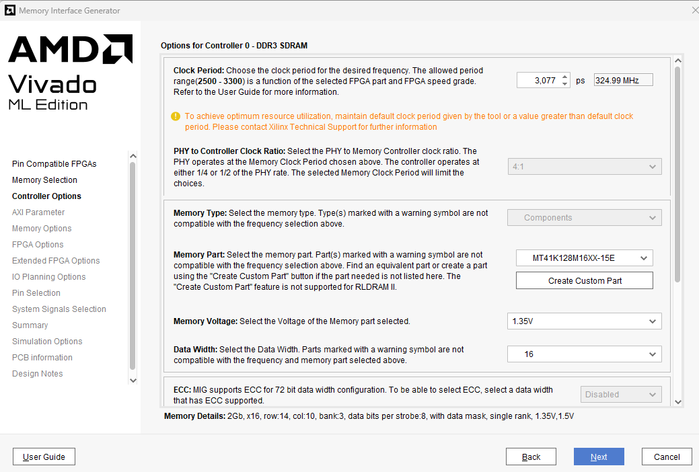
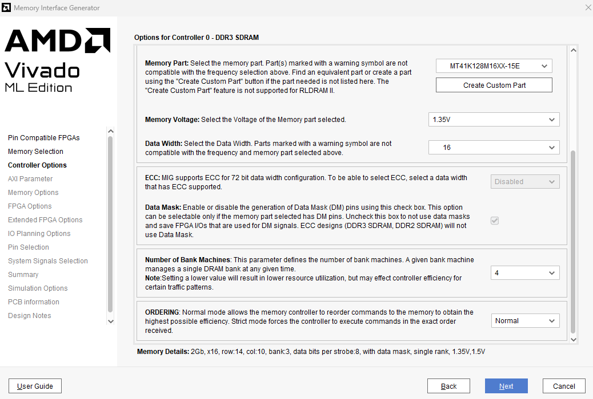

### Passo 5: Parâmetros AXI
Define como o barramento AXI vai se comportar do lado da FPGA. (Como apresenta as imagens)
* **Data Width:** `128` bits. 
* **Arbitration Scheme:** `RD_PRI_REG` (Prioridade para leitura).

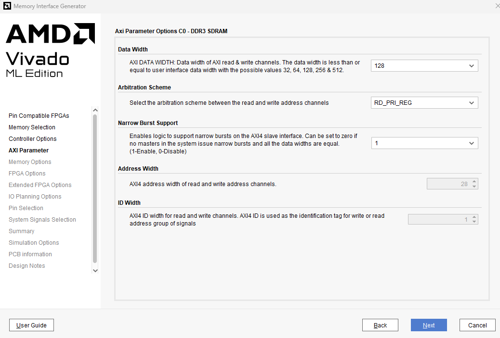

### Passo 6: Opções de Memória (Mapeamento e Impedância)
* **Input Clock Period:** `10000 ps` (100 MHz)
* **Output Driver Impedance Control / RTT:** `RZQ/6`
* **Memory Address Mapping:** `BANK | ROW | COLUMN`

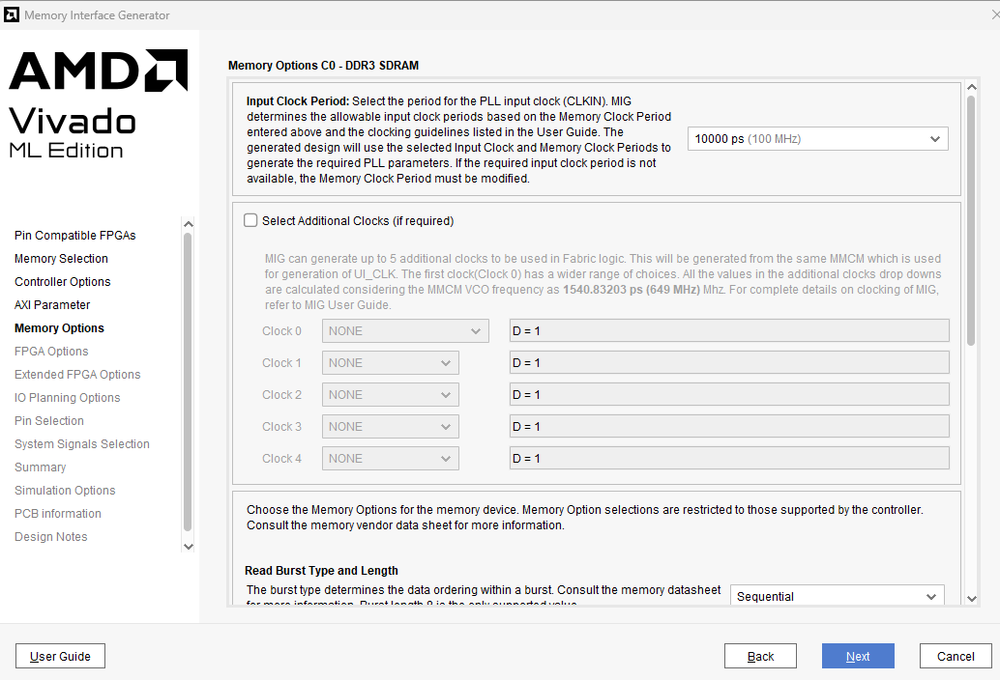
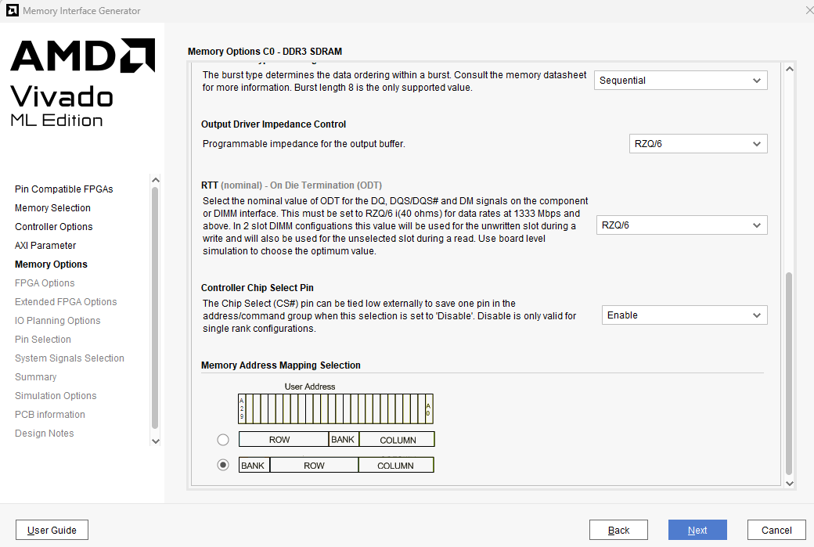

### Passo 7: Opções da FPGA (Clocks e Vref)
* **System Clock / Reference Clock:** `No Buffer`. Configuração vital! Isso significa que o clock do MIG não virá diretamente de um pino de fora da placa com um buffer dedicado, mas sim de outro módulo interno do Vivado (como um *Clocking Wizard*).
* **System Reset Polarity:** `ACTIVE LOW`. O MIG será resetado quando o sinal for 0 (nível lógico baixo).
* **Internal Vref:** Habilitado. Economiza pinos físicos da FPGA ao usar a referência interna de tensão para os pinos de dados.

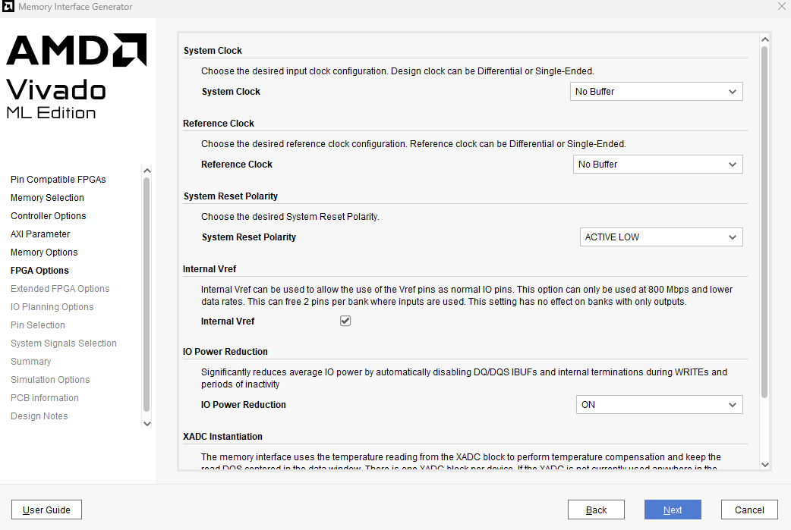
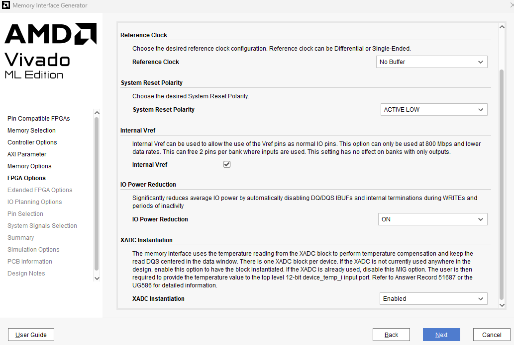

### Passo 8: Opções Estendidas da FPGA (Terminação Interna)
* **Internal Termination Impedance:** `50 Ohms`.

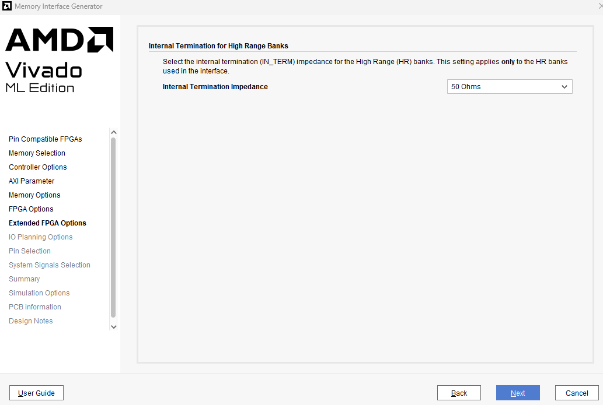

### Passo 9: Planejamento de IO (IO Planning)
* **Pin/Bank Selection Mode:** `Fixed Pin Out: Pre-existing pin out is known and fixed`. 
Como estamos trabalhando com uma placa de desenvolvimento comercial (Arty A7), as trilhas de cobre entre a FPGA e o chip de memória DDR3 já estão soldadas em pinos específicos. Por isso, não podemos deixar o Vivado escolher os pinos aleatoriamente (New Design), precisamos forçar o uso da pinagem fixa existente.

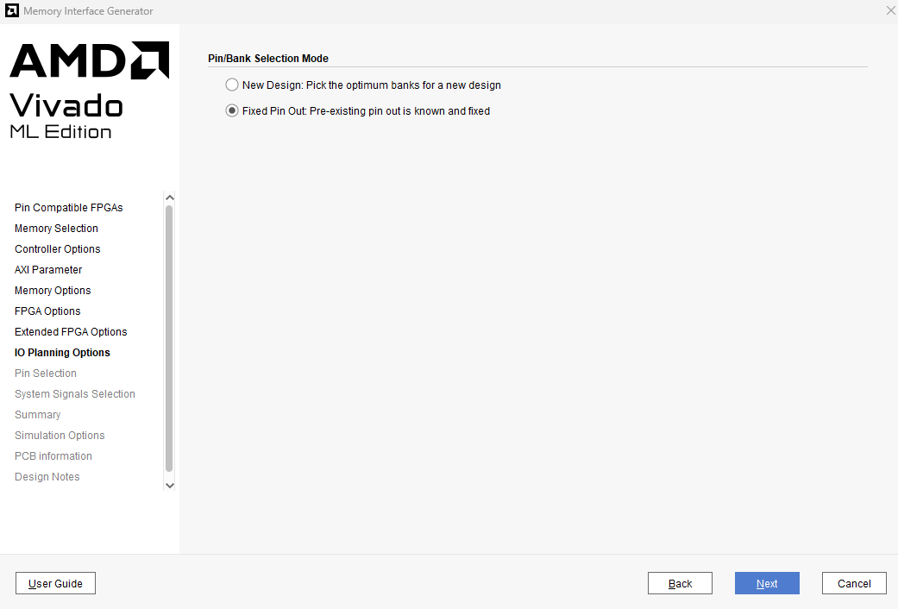

### Passo 10: Seleção de Pinos (Lendo o arquivo UCF/XDC)
*Na tela seguinte (Pin Selection), que é habilitada pela escolha do passo anterior:*
* Você deve clicar em **Read XDC/UCF** e carregar o arquivo **`arty_a7_mig.ucf`** e validar.